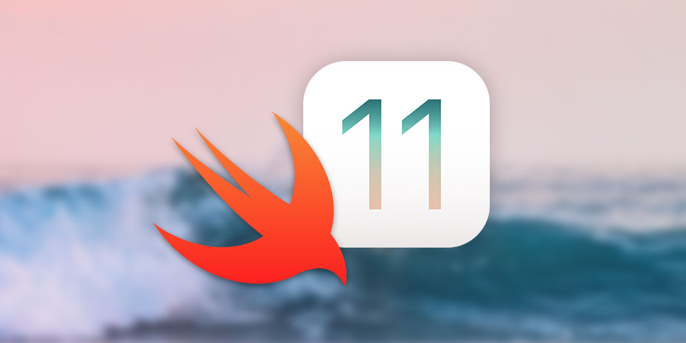
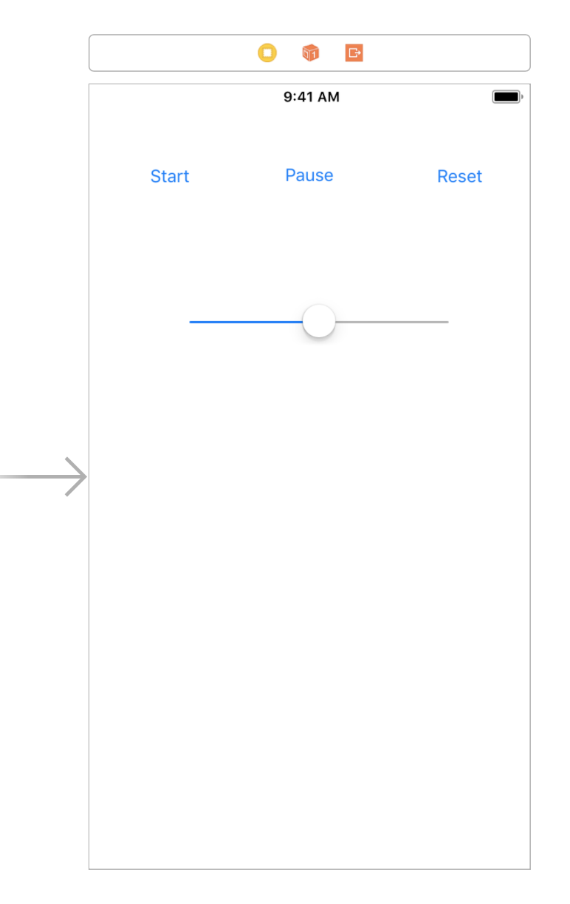

# Sound App



Swift 4 ile geliştirilen bir iOS uygulamasıdır. İçerisinde ses dosyaları ile ilgili birkaç işlem barındırır.
Ses dosyasını açma,duraklatma ya da kapatma işlemlerini yapacağız. Bu uygulamadaki amacımız ses dosyaları ile nasıl
çalışılır onu öğrenmek ve projelerimizde bu yapıyı kullanmaktır. <br>


## Ekran Tasarımı

 <br>

Tasarımda 3 adet buton bulunmaktadır. Müziği durdurmak,başlatmak ve bitirmek gibi işlemleri yapmaktadır. <br>
Müziğin ses ayarlarını değiştirmek içinse slider kullanılmıştır. <br>

## Uygulamanın Kodları

```swift 
import AVFoundation
```

Ses ile ilgili işlemleri yapmak için yukarıdaki kodu projemize ekliyoruz. <br>

```swift 
var player = AVAudioPlayer() 
```

Player nesnesi oluşturuldu. Bu nesneyi kullanarak çeşitli işlemler yapacağız. <br>

```swift 
@IBOutlet weak var audioSlider: UISlider!
```

Slider'ın değerlerini kontrol etmek için bir outlet tanımladık. <br>

```swift 
@IBAction func sliderClicked(_ sender: Any) {
        player.volume = audioSlider.value
    }
```

Slider'ın artması ve azalması ile ilgili işlemlerin yapıldığı metoddur.  <br>

```swift 
 override func viewDidLoad() {
        super.viewDidLoad()
      
        let audio = Bundle.main.path(forResource: "dalepapi", ofType: "mp3")
        
        do {
            try player = AVAudioPlayer(contentsOf: URL(fileURLWithPath : audio!))
        } catch  {
            print("Video is not found")
        }
        
    }
    } 
```

ViewDidLoad() metodu içinde projemizdeki ses dosyasını tanıtıyoruz. Proje çalışıncases yüklenirse try bloğuna girecek. Yüklenmezse video bulunamadı hatası verecektir. İsimlendirmelere ve uzantılara dikkat ederseniz herhangi bir hata ile karşılaşmazsınız. <br>


```swift 
@IBAction func startClicked(_ sender: Any) {
        
        player.play()
        
    }
    
    @IBAction func pauseClicked(_ sender: Any) {
        player.pause()
    }
    
   
    
    @IBAction func resetClicked(_ sender: Any) {
        player.stop()
        player.currentTime = 0
    }
    
```

Tanımladığımız üç butonda tıklanınca bir olay gerçekleşmesini istiyoruz. Kullanıcı start butonuna tıklayınca şarkı başlatılıyor. Kullanıcı stop tuşuna basınca müzik durduruluyor. Kullanıcı Start tuşuna basınca müzik kaldığı yerden devam eder. Reset tuşuna basınca ise şarkı sıfırlanıyor. Start tuşuna basınca tekrardan oynamaya başlıyor. <br>


## Not  

Eksik ya da hatalı bilgiler görürseniz lütfen benimle iletişime geçiniz. Desteklerinizi bekliyorum.

    
    


